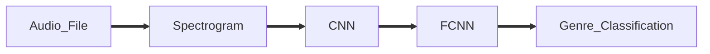

Music Genre Classification
===
This project is about classification of music based on their genres with the help of Deep Learning and DSP
---

---

# Sequence of Classification

---

- An audio file is imported
- The waveform and sample rate of the audio file is extracted
- From this waveform, Its spectrogram is generated
- This spectrogram is fed into a CNN
- The output of the CNN is fed into a FCNN
- From FCNN the classified music genre is obtained

---

# Graphs

---

# Results
> Max Training Set Accuracy : 100%

> Max Test Set Accuracy : 65%
